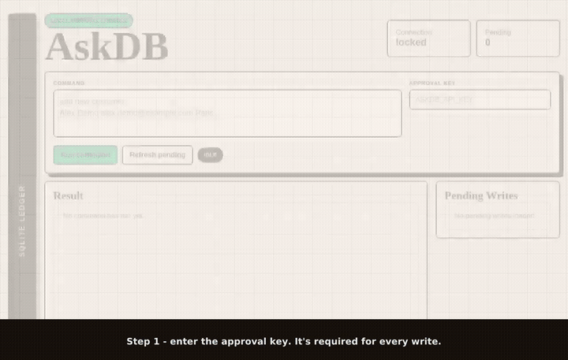

# askdb_mcp

`askdb_mcp` is a local Python MCP server for asking a SQLite database questions in natural language. It uses OpenAI to generate SQL, executes read queries after validation, and requires FastAPI approval before running `INSERT`, `UPDATE`, or `DELETE`.

## Demo



*Silent GIF preview above — for the full-quality video with narration, see [docs/media/ui-demo.mp4](docs/media/ui-demo.mp4).*

A walkthrough of the local approval console: set the approval key, ask `show all customers` (executes instantly), ask for one customer by city, then `add customer …` — which is held as a pending proposal in the UI until it is approved. Narrated, with captions burned in.

## Features

- MCP tools: `askdb_ask_database`, `askdb_describe_schema`, `askdb_get_pending_write`
- MCP over stdio (local) and streamable HTTP at `/mcp` (local and Vercel)
- Fixed SQLite database path from `SQLITE_DB_PATH`
- OpenAI Responses API with structured SQL output (optional: without a key, built-in sample queries still work)
- SQL validation for single-statement SQLite queries, enforced again inside SQLite:
  reads run on a read-only connection, and an authorizer blocks schema changes, `ATTACH`, and `PRAGMA`
- Read queries execute immediately; `WITH ... DELETE` style statements are treated as writes
- Write queries are stored as pending proposals; failed approvals are recorded as `failed`, not lost
- FastAPI approval endpoints and browser UI protected by `X-AskDB-Key`

## Install

```bash
python -m venv .venv
source .venv/bin/activate
pip install -e ".[dev]"
```

## Configure

Create a sample database (customers, products, orders) if you do not have one:

```bash
python -m askdb_mcp.demo_db example.sqlite
```

Then set the environment (or put the same keys in `.env`):

```bash
export OPENAI_API_KEY="sk-your-key"
export SQLITE_DB_PATH="/absolute/path/to/database.sqlite"
export ASKDB_API_KEY="change-me-local-key"
```

## Run

```bash
askdb-mcp
```

The MCP server runs on stdio. The FastAPI approval server starts in the same process on `127.0.0.1:8765` by default. Open http://127.0.0.1:8765 for the browser UI.

## Deploy to Vercel

The repository root contains `app.py`, which Vercel detects as a FastAPI app. The hosted deployment serves the browser UI, the approval API, and a remote MCP endpoint at `/mcp`.

```bash
vercel env add ASKDB_API_KEY production   # 12+ characters
vercel env add OPENAI_API_KEY production  # optional
vercel deploy --prod
```

### Access modes

`ASKDB_AUTH_MODE` picks how the UI, API, and `/mcp` are protected:

| Mode | Setting | Behaviour |
| --- | --- | --- |
| With approval key | `ASKDB_AUTH_MODE=required` (default) | Every data endpoint needs `X-AskDB-Key` (or `Authorization: Bearer` on `/mcp`). |
| Without key (testing) | `ASKDB_AUTH_MODE=optional` | Anyone can read, propose writes, and approve or reject them without a key. A supplied key must still be correct. The UI shows a *With approval key / Without key* switch. |

Writes still wait in *Pending Writes* in both modes; optional mode only removes the key requirement. Use it for demos and testing, not for data you care about.

Hosted behaviour differs from local use:

- Without `SQLITE_DB_PATH`, a sample database is created in `/tmp` on each cold start. Vercel's filesystem is ephemeral, so approved writes are visible only until the instance recycles. Use this as a demo sandbox, not as durable storage.
- Pending writes live in memory, so a proposal can disappear if a request lands on a new instance; just ask again.
- Schema metadata and questions are sent to OpenAI when `OPENAI_API_KEY` is set; result rows are not.
- In `required` mode, `ASKDB_API_KEY` guards every data endpoint. Share it only with people who should be able to query and approve writes.

Connect an MCP client to the deployment:

```bash
claude mcp add --transport http askdb https://<your-app>.vercel.app/mcp \
  --header "Authorization: Bearer $ASKDB_API_KEY"
```

## Approval API

```bash
curl -X POST -H "X-AskDB-Key: $ASKDB_API_KEY" -H "Content-Type: application/json" \
  -d '{"question": "show all customers"}' http://127.0.0.1:8765/ask
curl -H "X-AskDB-Key: $ASKDB_API_KEY" http://127.0.0.1:8765/schema
curl -H "X-AskDB-Key: $ASKDB_API_KEY" http://127.0.0.1:8765/pending-writes
curl -X POST -H "X-AskDB-Key: $ASKDB_API_KEY" http://127.0.0.1:8765/pending-writes/{id}/approve
curl -X POST -H "X-AskDB-Key: $ASKDB_API_KEY" http://127.0.0.1:8765/pending-writes/{id}/reject
```

## MCP Client Example

```json
{
  "mcpServers": {
    "askdb_mcp": {
      "command": "askdb-mcp",
      "env": {
        "OPENAI_API_KEY": "sk-your-key",
        "SQLITE_DB_PATH": "/absolute/path/to/database.sqlite",
        "ASKDB_API_KEY": "change-me-local-key"
      }
    }
  }
}
```

## Verify

```bash
python -m py_compile askdb_mcp/*.py
pytest
```

